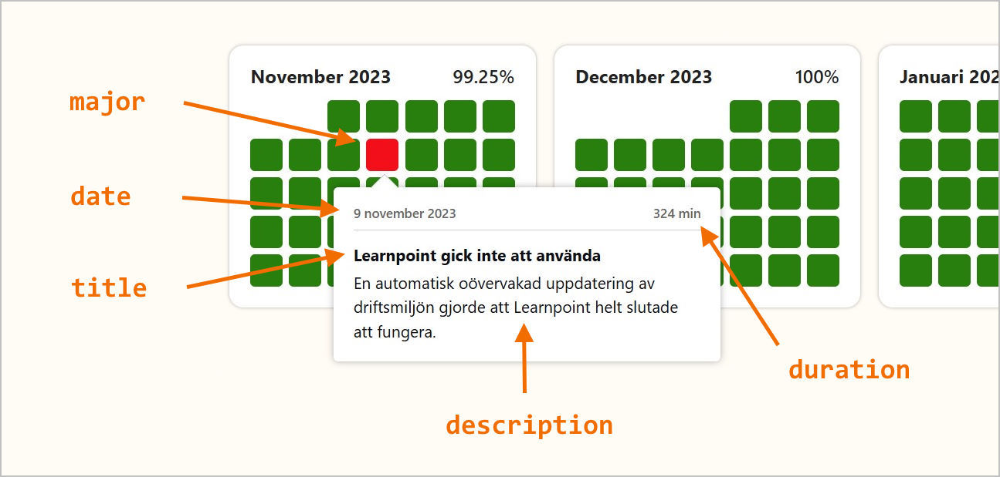

## `status.json`

`fullyOperational`: This property indicates if Learnpoint is up and running. Set to false if there are any problems.

`notFullyOperationalMessage`: Use this property to display a message when Learnpoint is not fully operational. (When Learnpoint is fully operational, this message is ignored.)

`messages`: This is the list of messages you can choose from by setting the `notFullyOperationalMessage` property.

## `incidents.json`

`date`: Represents the date of the incident.

`major`: Set to true if the incident was major. If major, then the incident day in the calendar will be red, otherwise it will be orange.

`minutes`: Duration of the incident, expressed in minutes. The duration will be counted directly towards the uptime for the month.

`title`: Title of the incident.

`decscription`: Description of the incident.

## How to: Set status

Modify `status.json` and push to the main branch.

## How to: Add an incident

Modify `incidents.json` and push to the main branch.

## How to: Preview changes before commit

Run `index.html` in a browser using a static web server.
